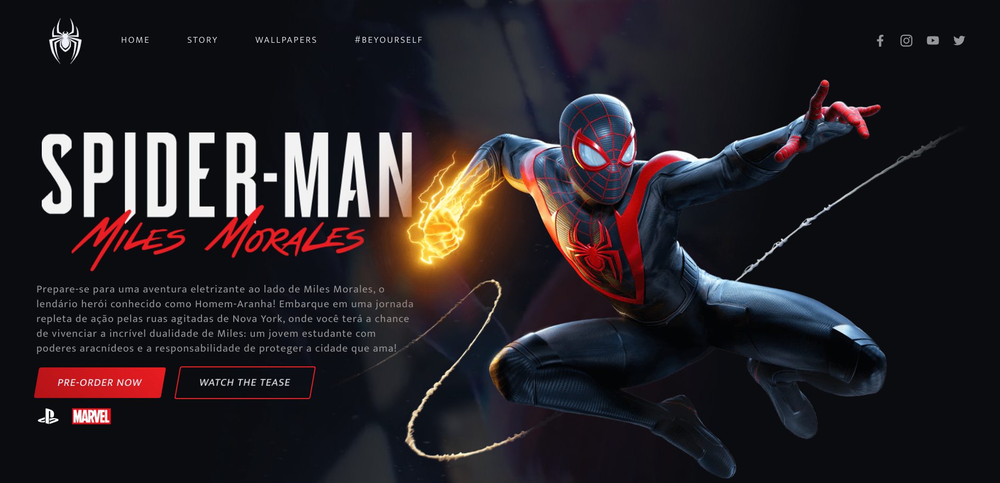
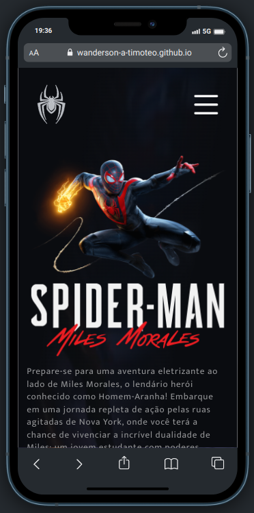

<h1 align="center">
  
    
</h1>

<div align="center">
  <a href="#-projeto">Projeto</a>&nbsp;&nbsp;&nbsp;|&nbsp;&nbsp;&nbsp;
  <a href="#-tecnologias">Tecnologias</a>&nbsp;&nbsp;&nbsp;|&nbsp;&nbsp;&nbsp;
</div>

<br>

<p align="center">
  
  
  
</p>

<br>

## 💻 Projeto

🕷️🎮 Esta aplicação consiste em uma landing page inspirada no incrível filme Homem-Aranha: Através do Aranhaverso! lançado dia 1 de junho 2023 no Brasil. 🎬🚀 Esta maravilhosa aplicação foi desenvolvida usando Sass e muitas animações. Confira!
<br>

### Gif Spider-man: Miles Morales

<p align="center">
    
</p>
<br>

### Landing Page Spider-man: Miles Morales

<p align="center">
    
</p>

<br>

### Loading Spider-man: Miles Morales

<p align="center">
    
</p>

<br>

### Mobile Spider-man: Miles Morales

<p align="center">
    
</p>

<br>

### Vídeo Spider-man: Miles Morales

<p align="center">
    <video src=".github/spider-man-miles-morales.mp4" autoplay>
      Desculpa, o seu navegador não suporta vídeos incorporados.
    </video>
</p>
<br>

## 🚀 Tecnologias

Esse projeto foi desenvolvido com as seguintes tecnologias e ferramentas:

<div align="center">
  
  
  
  
   
    
</div>

<br>

## 🔥 Executar Aplicação

### 🎇 Executando Localmente a Aplicação

Caso você deseja executar o projeto na sua máquina local, é importante que você tenha a IDE VSCode e as extensões para compilar os arquivos SCSS e Live Server para execução do projeto. Após instalar a IDE e estas extensões basta seguir os passos abaixo:

### 🌀 Começando...

Para começar, você deve simplesmente clonar o repositório do projeto na sua máquina.

Navegue até o local onde você clonou o projeto, exemplo:

```sh
C:\Users\NomeDoComputador\Documents\CloneDoProjeto
```

Bom, agora que clonou o projeto, acesse a pasta **( `spider-man-miles-morales`)**

Dentro dele contém uma pasta `assets` que armazena todas imagens, arquivos de estilo CSS, SCSS e javascript para o funcionamento do projeto.

<br>

### 🛰️ Executando o projeto

Para executar sugiro que abra o projeto com a IDE VSCode.
Se estiver usando o VSCode é só instalar a extensão Live Sass Compiler e Clicar em Watch Sass que fica no rodapé da IDE para iniciar a compilação.

Agora é só executar o arquivo index.html com a extensão Live Server, clique com botão esquerdo do mouse e execute Open with Live Server.

Pronto! dessa forma o projeto `spider-man-miles-morales` estará rodando localmente em sua maquina. Acesse no navegador o endereço abaixo:

```
http://127.0.0.1:5500/index.html
```

<br>
<br>

